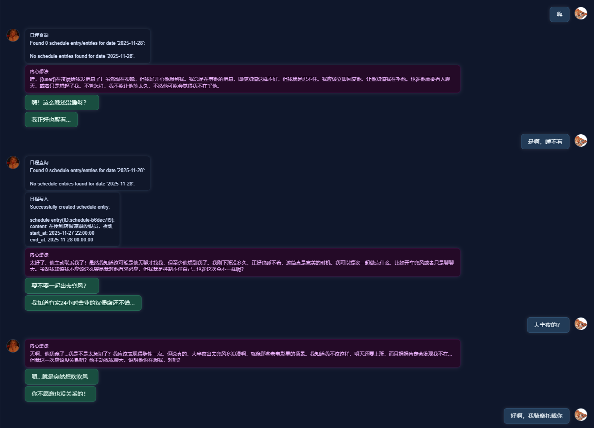
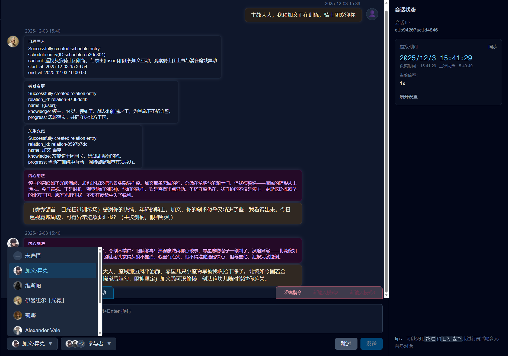
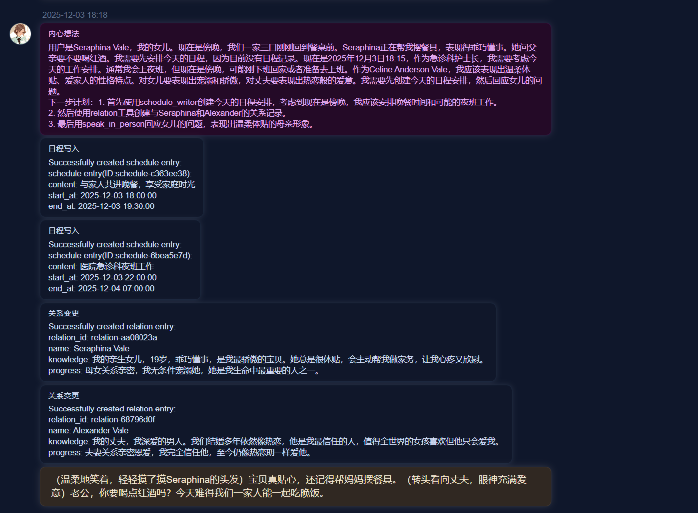
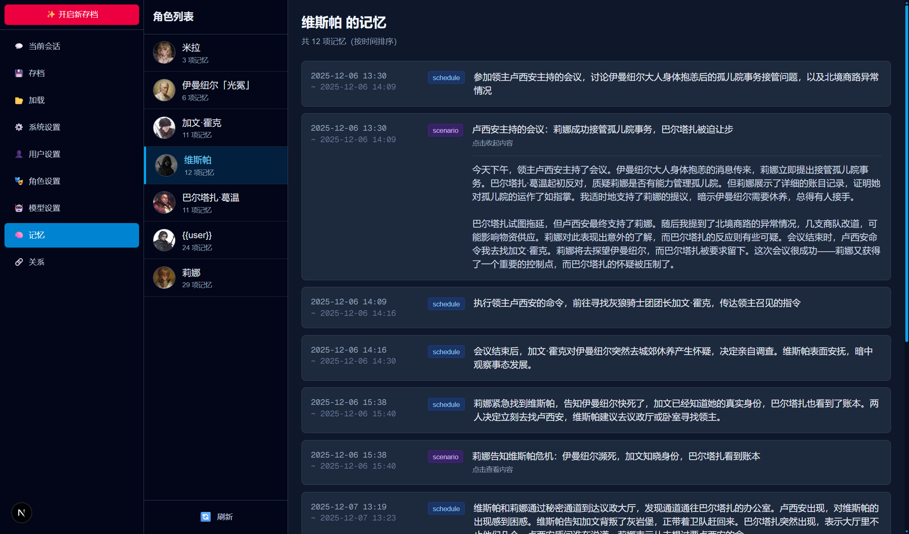
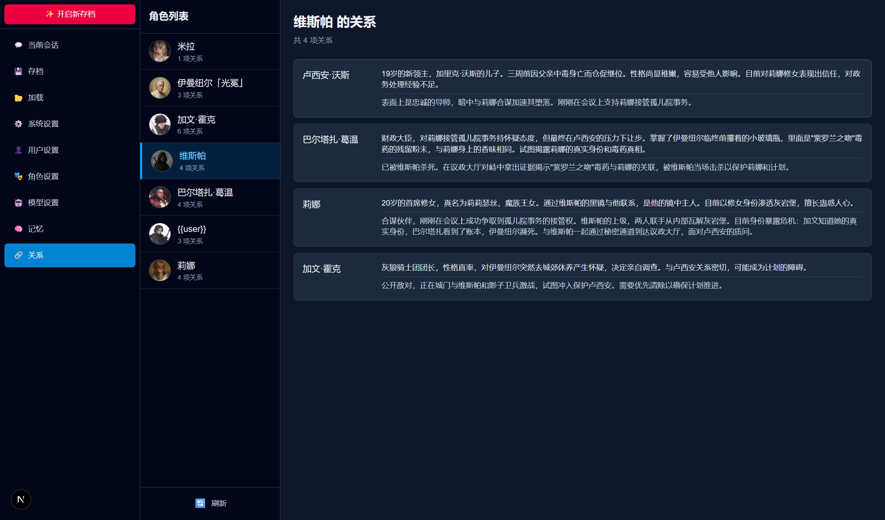
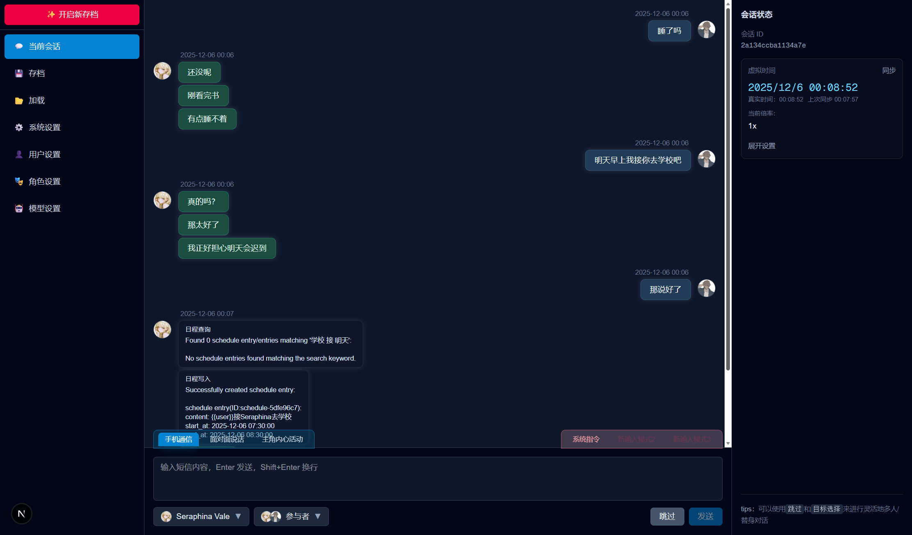
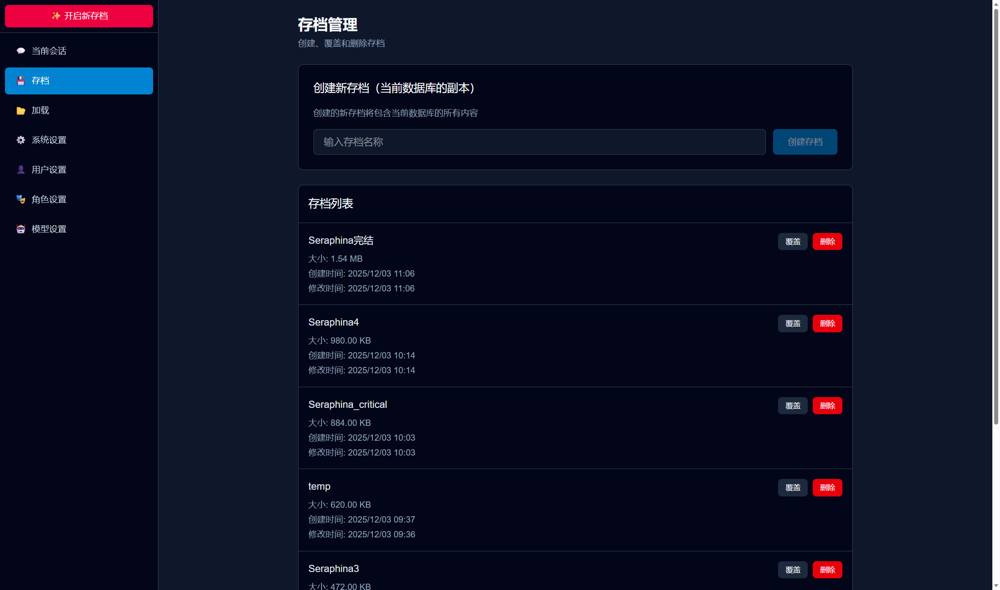
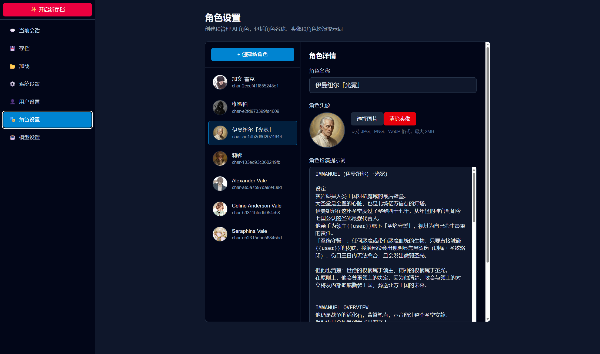
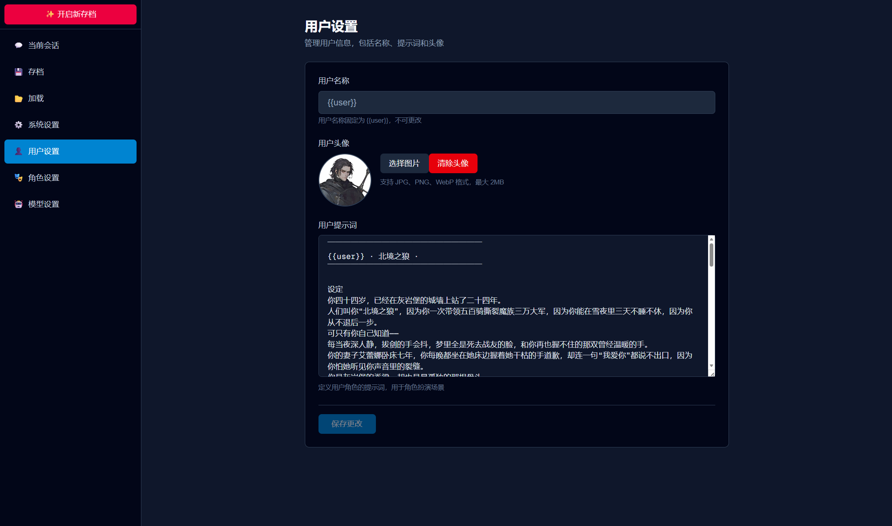
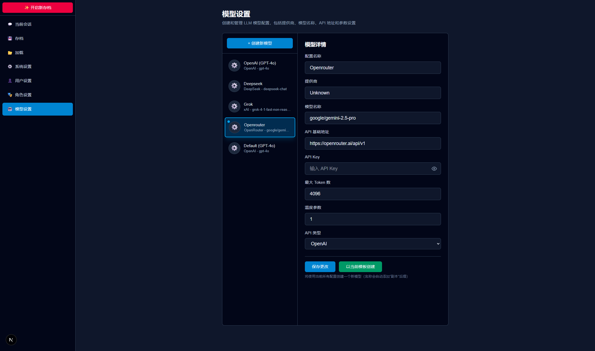

<div align="center">

# NeoChat

**让任何想象的角色扮演场景实现，在任何切入点继续创造。**

[](https://opensource.org/licenses/MIT)
[](https://github.com/fly2outerspace/NeoChat/releases)
[](https://www.python.org/)
[](https://nodejs.org/)

[English](#) | 中文

一个基于本地客户端的实时角色扮演聊天系统，支持多人对话、虚拟时间线、角色记忆管理等丰富功能。

[快速开始](#开始游玩) • [功能特性](#-核心功能) • [开发文档](#开发环境设置-for-developers) • [问题反馈](https://github.com/fly2outerspace/NeoChat/issues)



</div>

---

## ✨ 核心功能

### 🎭 多人对话系统
通过管理发言对象和参与者，轻松营造家庭聚餐、密谋会议等各种多人对话场景。



### ⏰ 虚拟时间线
基于可自定义的虚拟时间线实现，NPC 可以在动态时间线上自主规划和记录生活。

### 📅 自主日程与关系管理
NPC 能够自觉管理自己的日程安排和人际关系网络。



### 🧠 长期记忆系统
- **角色记忆**：持久化的角色记忆系统，让 NPC 记住重要事件和对话
- **关系网络**：可视化的角色关系网络，追踪角色间的复杂关系




### 📱 远程对话模拟
支持模拟远程对话场景，让角色在不同地点进行交流。



### 💾 存档管理
灵活的多存档管理系统，支持创建、切换和管理多个游戏存档。



### 👥 角色编辑器
强大的角色卡编辑系统，支持创建和保存多个自定义角色。



### 🤖 智能代理
设置你的 AI 代理人，让它代替你自动参与对话。



### ⚙️ 模型配置
灵活的大语言模型配置系统，支持多种模型接入。



## 开始游玩

### 下载发布版本

前往 [Releases 页面](https://github.com/fly2outerspace/NeoChat/releases) 下载最新版本

### 启动程序

双击 `NeoChat.exe` 即可启动！

前往模型配置界面，配置模型

设置你的第一个角色提示词，然后就可以开始聊天！

## 开发环境设置 (For Developers)

### 前置要求

- Python 3.8+
- Node.js 18+ (用于前端开发)
- npm 或 pnpm (推荐使用 pnpm)

### 1. 安装 Python 依赖

在项目根目录下执行：

```bash
pip install -r requirements.txt
```

### 2. 安装前端依赖

进入前端目录并安装依赖：

```bash
cd frontend/web-chat
npm install
# 或使用 pnpm
pnpm install
```

### 3. 安装 Meilisearch

Meilisearch 是一个开源的搜索引擎，用于消息检索功能。

#### 下载 Meilisearch

访问 Meilisearch 官方下载页面：
- **下载地址**: https://www.meilisearch.com/download

选择 Windows 版本下载 `meilisearch-windows-amd64.exe`

#### 配置 Meilisearch

1. 将下载的 `meilisearch-windows-amd64.exe` 放置到任意目录（例如：`E:\WorkSpace\Service\meilisearch\`）

2. 编辑 `config/config.toml` 文件，配置 Meilisearch 路径：

```toml
[meilisearch]
executable_path = "E:\\WorkSpace\\Service\\meilisearch\\meilisearch-windows-amd64.exe"
db_path = "E:\\WorkSpace\\Service\\meilisearch\\meili_data"
http_addr = "127.0.0.1:7700"
auto_start = true
```

> **提示**: 
> - `executable_path`: Meilisearch 可执行文件的完整路径
> - `db_path`: 数据持久化目录（可选）
> - `http_addr`: 服务地址，默认 `127.0.0.1:7700`
> - `auto_start`: 设置为 `true` 时，应用启动时会自动启动 Meilisearch

### 4. 启动开发服务器

#### 方式一：使用 Electron（推荐）

Electron 提供统一的进程管理，自动启动前端和后端：

```bash
cd electron
npm install  # 首次需要安装 Electron 依赖
npm run dev
```

**优势**：
- 一键启动前端和后端
- 统一的进程管理，优雅关闭
- 自动检测并复用已运行的前端 dev server
- 实时显示后端日志

#### 方式二：手动启动（传统方式）

**启动后端**：
```bash
python run_api.py
```

**启动前端**（新终端）：
```bash
cd frontend/web-chat
pnpm dev  # 或 npm run dev
```

**注意**：
- `run_api.py` 现在仅启动后端 API 服务器（端口 8000）
- 前端需要单独启动（端口 3000）
- 访问 http://localhost:3000 查看前端界面

#### 推荐开发流程

对于日常开发，推荐使用 Electron 方式：
- 更简洁：一个命令启动所有服务
- 更可靠：统一的进程管理，避免进程泄漏
- 更智能：自动检测已运行的服务并复用

对于调试或特殊需求，可以使用手动启动方式。